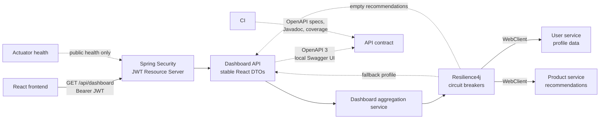

# React BFF Gateway


[](https://danielemasone.github.io/react-bff-gateway/)


[](LICENSE)

Production-oriented Backend for Frontend (BFF) for a React dashboard. The BFF exposes one stable dashboard API, validates JWTs, aggregates downstream user and product services with `WebClient`, applies Resilience4j fallbacks, and publishes generated OpenAPI, Javadoc, and JaCoCo documentation through GitHub Pages.

## Live Documentation

- [Portfolio landing page](https://danielemasone.github.io/react-bff-gateway/)
- [User Guide](https://danielemasone.github.io/react-bff-gateway/user-guide/)
- [Javadoc](https://danielemasone.github.io/react-bff-gateway/javadoc/)
- [JaCoCo coverage](https://danielemasone.github.io/react-bff-gateway/coverage/)
- [Published Swagger UI (read-only)](https://danielemasone.github.io/react-bff-gateway/swagger-ui/)
- [OpenAPI JSON](https://danielemasone.github.io/react-bff-gateway/api/openapi.json)
- [OpenAPI YAML](https://danielemasone.github.io/react-bff-gateway/api/openapi.yaml)

## Architecture



The BFF is one deployable Spring Boot WebFlux application. It hides downstream response shapes and service locations from the React app, then returns immutable Java record DTOs tailored to the dashboard.

## Main Endpoint

```http
GET /api/dashboard
Authorization: Bearer <jwt>
```

Example response:

```json
{
  "user": {
    "id": "user-123",
    "displayName": "Demo User",
    "email": "demo@example.com"
  },
  "recommendedProducts": [
    {
      "id": "prd-001",
      "name": "Premium Account",
      "price": 9.99
    }
  ]
}
```

## Request Flow

1. The React app calls `/api/dashboard` with a Bearer JWT.
2. Spring Security validates the token before the controller runs.
3. `DashboardService` uses the JWT subject as the dashboard user id.
4. The gateway calls user and product services through `WebClient`.
5. Resilience4j circuit breakers provide stable fallback responses when downstreams fail.

## Security Summary

- `/api/**` requires a valid JWT.
- `/actuator/health` and `/actuator/health/**` are public.
- Every other route is denied by default.
- Authentication and access-denied failures return structured JSON `ApiError` payloads.
- The base profile contains no signing secret. The `local` profile supplies a documented development-only HS256 secret for the included token helper; production-style deployments should use `BFF_JWT_JWK_SET_URI` or `BFF_JWT_ISSUER_URI`.
- OpenAPI JSON/YAML and Swagger UI are disabled by default and enabled intentionally in the `local` profile.

## Resilience Summary

- User service failure returns a safe `Guest User` profile for the authenticated subject.
- Product service failure returns an empty recommendation list.
- Circuit breakers are registered with Actuator health.
- The frontend receives a stable dashboard response shape even when downstream services are unavailable.

## Tech Stack

- Java 21 and Maven Wrapper
- Spring Boot 3.4.7, WebFlux, WebClient, Actuator
- Spring Security OAuth2 Resource Server / JWT
- Springdoc OpenAPI 3 for WebFlux and Swagger UI
- Resilience4j circuit breakers
- JUnit 5, Spring Boot Test, WebTestClient, Reactor Test, MockWebServer, ArchUnit
- JaCoCo coverage reports and Maven coverage gates
- Javadoc generated under Java 21
- Docker Compose with WireMock downstream services
- GitHub Actions and GitHub Pages

## Project Structure

```text
src/main/java/com/dani/bff
|-- api       HTTP controllers
|-- config    security, WebClient, OpenAPI, and configuration properties
|-- dto       immutable API and downstream records
|-- error     structured API errors and exception handling
|-- gateway   downstream WebClient clients and resilience boundary
`-- service   dashboard aggregation orchestration

.github/pages/index.html      single maintained GitHub Pages landing page template
.github/pages/user-guide      HTML source for the Pages-published User Guide
.github/pages/assets          shared CSS and JavaScript for Pages documentation
.github/workflows/ci.yml      CI, artifact publishing, and Pages deployment
docker/wiremock               local mock user and product services
scripts/build-pages.ps1       deterministic GitHub Pages artifact assembly
scripts/validate-pages-links.ps1 lightweight internal Pages link validation
scripts/create-local-jwt.ps1  local HS256 JWT helper
```

## Quick Start

Run the verification build:

```bash
./mvnw clean verify
```

Start the local Docker stack:

```bash
docker compose up --build
```

Generate a local JWT and call the dashboard endpoint:

```powershell
$token = powershell -ExecutionPolicy Bypass -File .\scripts\create-local-jwt.ps1
Invoke-WebRequest -Headers @{ Authorization = "Bearer $token" } http://localhost:8080/api/dashboard
```

Open local Swagger UI when the app runs with the `local` profile:

```text
http://localhost:8080/swagger-ui.html
```

Detailed IntelliJ, Docker, JWT, Swagger, OpenAPI, and troubleshooting instructions are in the [User Guide](https://danielemasone.github.io/react-bff-gateway/user-guide/).

## Testing, Coverage, and Javadoc

`./mvnw clean verify` runs the meaningful test suite, packages the application, generates JaCoCo coverage under `target/site/jacoco`, and enforces coverage gates.

The tests cover security behavior, dashboard aggregation, downstream HTTP success and failure cases, circuit-breaker fallbacks, DTO serialization, structured errors, OpenAPI metadata, Swagger availability in the documentation profile, and package boundaries.

Generate Javadoc locally:

```bash
./mvnw javadoc:javadoc
```

Javadoc is written to `target/site/apidocs`. Generated coverage, Javadoc, OpenAPI specs, and Swagger UI output are not committed.

## CI/CD and GitHub Pages

`.github/workflows/ci.yml` runs on pull requests and pushes to `main`. It uses Java 21, Maven dependency caching, `mvn verify`, Javadoc generation, OpenAPI export from the running BFF, artifact uploads, and GitHub Pages deployment only after successful pushes to `main`.

GitHub Pages is generated during CI from:

- the single maintained landing page template
- the HTML User Guide source under `.github/pages/user-guide/`
- shared Pages CSS and JavaScript under `.github/pages/assets/`
- generated Javadoc
- generated JaCoCo coverage
- generated OpenAPI JSON/YAML
- generated static Swagger UI assets assembled from Springdoc

The User Guide is maintained as direct HTML source instead of Markdown plus conversion. The guide is small, and direct HTML provides reliable accessibility and responsive layout control without introducing a documentation framework or frontend build chain.

`scripts/build-pages.ps1` assembles all Pages content under `target/pages`. `scripts/validate-pages-links.ps1` validates required routes and internal links before deployment.

No generated reports or Pages output are committed.

## Design Trade-Offs

### Why a BFF

A BFF gives the React app a stable, frontend-oriented API and keeps backend topology, failure handling, and service-specific contracts out of browser code.

### Why WebClient

WebClient supports non-blocking downstream HTTP composition without adding unnecessary domain complexity.

### Why Records

DTOs are Java records to keep response contracts immutable, concise, and serialization-friendly.

### Why Generated OpenAPI

The API contract is generated from the running application so Swagger UI, CI artifacts, and Pages documentation stay aligned with the implemented controller and DTOs.

### Why No MapStruct

The current downstream-to-frontend mappings are small and explicit. Adding generated mapper code would add noise without improving maintainability.

### Why One Deployable

The project is intentionally one deployable gateway. Splitting it into more services would add operational cost without improving the example.

## What This Repository Demonstrates

- Backend for Frontend pattern for React applications
- JWT-secured API boundary with structured JSON errors
- OpenAPI 3 documentation with local and Pages-published Swagger UI
- WebClient-based downstream aggregation
- Resilience4j fallbacks with stable frontend contracts
- Docker-local development with mock downstream services
- Meaningful automated tests and architecture rules
- CI-generated coverage, Javadoc, OpenAPI specs, and GitHub Pages documentation

## License

Released under the MIT License. See [LICENSE](LICENSE).

Copyright (c) 2026 Daniele Masone.
