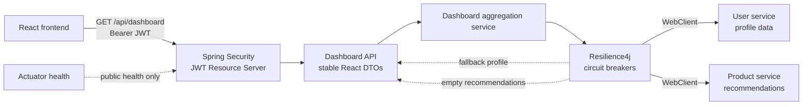

# React BFF Gateway

Production-oriented Backend for Frontend (BFF) for a React dashboard, built with Java 21, Spring Boot WebFlux, WebClient, JWT Resource Server security, Resilience4j, Docker, JaCoCo, Javadoc, GitHub Actions, and GitHub Pages.

The project gives a React frontend one stable API while the BFF owns authentication, downstream aggregation, response adaptation, resilience, and operational concerns.

## Architecture



The BFF is a single deployable Spring Boot application. It hides downstream response shapes and service locations from the frontend, then returns immutable Java record DTOs optimized for the React dashboard.

## Main Endpoint

```http
GET /api/dashboard
Authorization: Bearer <jwt>
```

Example response:

```json
{
  "user": {
    "id": "user-123",
    "displayName": "Demo User",
    "email": "demo@example.com"
  },
  "recommendedProducts": [
    {
      "id": "prd-001",
      "name": "Premium Account",
      "price": 9.99
    }
  ]
}
```

## Request Flow

1. The React app calls `/api/dashboard` with a Bearer JWT.
2. Spring Security validates the token before the controller runs.
3. `DashboardService` extracts the JWT subject as the dashboard user id.
4. `ResilientDashboardGateway` calls user and product downstream services through `WebClient`.
5. Downstream contracts are mapped to stable BFF DTOs.
6. If a downstream service fails, Resilience4j returns a stable fallback response shape.

## Security Flow

- `/api/**` requires a valid JWT.
- `/actuator/health` and `/actuator/health/**` are public.
- Every other route is denied by default.
- Authentication and access-denied responses are JSON `ApiError` payloads.
- Tests use Spring Security mock JWT support and do not require a real identity provider.
- Local development uses HS256 for convenience; production-style deployments should use `BFF_JWT_JWK_SET_URI` or `BFF_JWT_ISSUER_URI`.

## Resilience Flow

- User service failure returns `Guest User` with the authenticated subject id.
- Product service failure returns an empty recommendation list.
- Circuit breakers are registered with Actuator health.
- The frontend receives a valid dashboard response even when one or both downstreams fail.

## Tech Stack

- Java 21
- Maven Wrapper
- Spring Boot WebFlux and WebClient
- Spring Security OAuth2 Resource Server / JWT
- Resilience4j circuit breakers
- Spring Boot Actuator
- JUnit 5, Spring Boot Test, WebTestClient, Reactor Test
- MockWebServer for downstream HTTP simulation
- WireMock for Docker-local downstream services
- ArchUnit for package boundary rules
- JaCoCo coverage reports and coverage checks
- Javadoc with Java 21 doclint
- Docker and Docker Compose
- GitHub Actions and GitHub Pages

## Project Structure

```text
src/main/java/com/dani/bff
|-- api       HTTP controllers
|-- config    security, WebClient, and configuration properties
|-- dto       immutable API and downstream records
|-- error     structured API errors and exception handling
|-- gateway   downstream WebClient clients and resilience boundary
`-- service   dashboard aggregation orchestration

.github/pages/index.html      GitHub Pages landing page template
.github/workflows/ci.yml      CI, artifact publishing, and Pages deployment
docker/wiremock               Local mock user and product services
scripts/create-local-jwt.ps1  Local HS256 JWT helper
```

## Run From IntelliJ

1. Install JDK 21.
2. Import the repository as a Maven project.
3. Create a Spring Boot run configuration for `ReactBffGatewayApplication`.
4. Set the active profile to `local`.
5. Start mock downstream services:

```powershell
docker compose up user-service product-service
```

6. Run the app from IntelliJ.
7. Create a local JWT:

```powershell
$token = powershell -ExecutionPolicy Bypass -File .\scripts\create-local-jwt.ps1
```

8. Call the dashboard endpoint:

```powershell
Invoke-WebRequest `
  -Headers @{ Authorization = "Bearer $token" } `
  http://localhost:8080/api/dashboard
```

## Docker Runtime

The Compose stack starts:

- BFF on `http://localhost:8080`
- WireMock user service on `http://localhost:8081`
- WireMock product service on `http://localhost:8082`

Start everything:

```bash
docker compose up --build
```

Create a local JWT and call the API:

```powershell
$token = powershell -ExecutionPolicy Bypass -File .\scripts\create-local-jwt.ps1
Invoke-WebRequest -Headers @{ Authorization = "Bearer $token" } http://localhost:8080/api/dashboard
```

Stop the stack:

```bash
docker compose down
```

Mock downstream endpoints:

- `GET http://localhost:8081/users/user-123`
- `GET http://localhost:8082/users/user-123/recommendations`

## Configuration

| Variable | Purpose | Default |
| --- | --- | --- |
| `SERVER_PORT` | BFF HTTP port | `8080` |
| `USER_SERVICE_BASE_URL` | User service base URL | `http://localhost:8081` |
| `PRODUCT_SERVICE_BASE_URL` | Product service base URL | `http://localhost:8082` |
| `USER_SERVICE_TIMEOUT` | User service timeout | `2s` |
| `PRODUCT_SERVICE_TIMEOUT` | Product service timeout | `2s` |
| `BFF_JWT_JWK_SET_URI` | JWK set URL for production-style JWT validation | empty |
| `BFF_JWT_ISSUER_URI` | OIDC issuer discovery URL for production-style JWT validation | empty |
| `BFF_JWT_SECRET` | Local HS256 secret when no JWK or issuer URI is supplied | local development secret |
| `BFF_JWT_ISSUER` | Optional expected JWT issuer | empty, set in Docker Compose |
| `BFF_JWT_AUDIENCE` | Expected JWT audience | `react-dashboard` |

Decoder precedence is `BFF_JWT_JWK_SET_URI`, then `BFF_JWT_ISSUER_URI`, then local `BFF_JWT_SECRET`.

## Observability

Configured Actuator endpoints:

- `/actuator/health`
- `/actuator/info`
- `/actuator/metrics`
- `/actuator/circuitbreakers`
- `/actuator/circuitbreakerevents`

Only health is public by default. Other configured endpoints remain behind the deny-by-default security policy unless the security model is intentionally changed.

## Tests

Run the full verification build:

```bash
./mvnw clean verify
```

The suite covers:

- authenticated dashboard access
- unauthenticated dashboard rejection
- public health endpoint access
- denied-by-default behavior
- dashboard aggregation
- user and product downstream success
- downstream failure fallbacks
- circuit breaker open-state behavior
- DTO serialization/deserialization
- structured error responses
- package boundaries with ArchUnit

Testcontainers is intentionally not used because this project has no database, broker, or containerized external runtime where it would add useful signal. MockWebServer and WireMock cover the HTTP boundaries directly.

## Coverage

JaCoCo runs during `verify` and writes HTML to:

```text
target/site/jacoco/index.html
```

Current bundle gates:

- instruction coverage: 70%
- branch coverage: 50%

Generated coverage artifacts are ignored and must not be committed.

## Javadoc

Generate Javadoc locally:

```bash
./mvnw javadoc:javadoc
```

Open:

```text
target/site/apidocs/index.html
```

Javadoc uses Java 21, English comments, and doclint with missing-comment enforcement disabled. Generated Javadoc artifacts are ignored and must not be committed.

## CI/CD

`.github/workflows/ci.yml` runs on pushes to `main` and on pull requests.

The workflow:

- checks out the repository with `actions/checkout`
- sets up Java 21 with `actions/setup-java` and Maven caching
- runs Maven `validate`
- runs `verify`, including tests, packaging, JaCoCo report generation, and coverage checks
- generates Javadoc
- uploads test reports on failure
- uploads JaCoCo HTML as an artifact
- uploads Javadoc as an artifact
- assembles GitHub Pages content from generated reports and `.github/pages/index.html`
- deploys Pages only after successful pushes to `main`

## GitHub Pages

The Pages site is generated during CI instead of committing generated static reports.

It includes:

- portfolio-grade project overview
- accessible architecture diagram
- local development and Docker instructions
- testing, coverage, and documentation summary
- links to the GitHub repository, Actions workflow, generated Javadoc, and JaCoCo coverage

Repository Pages settings should use GitHub Actions as the Pages source.

## Design Trade-Offs

### Why a BFF

A BFF gives the React app a stable, frontend-oriented API and keeps backend topology, failure handling, and service-specific contracts out of browser code.

### Why WebClient

WebClient supports non-blocking downstream HTTP composition without forcing unnecessary domain complexity.

### Why Records

DTOs are Java records to keep response contracts immutable, concise, and serialization-friendly.

### Why One Deployable

The project is intentionally one deployable gateway. Splitting it into more services would add operational cost without improving the example.

### Why No Lombok

Java records and explicit configuration classes keep the build transparent without Lombok.

## What This Repository Demonstrates

- Backend for Frontend pattern for React applications
- JWT-secured API boundary
- WebClient-based downstream aggregation
- Resilience4j fallbacks with stable frontend contracts
- Structured API errors
- Docker-local development with mock downstream services
- Meaningful automated tests and architecture rules
- CI-generated coverage and Javadoc
- GitHub Pages documentation assembled from CI artifacts
